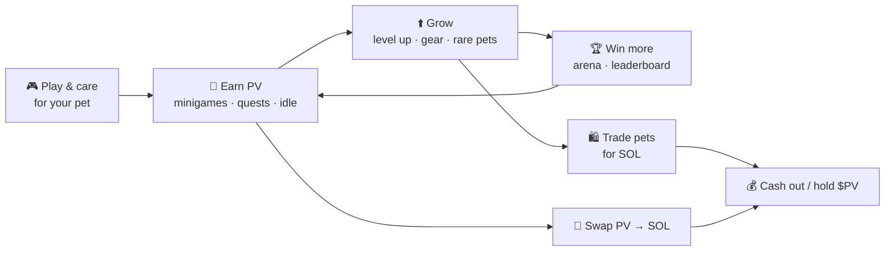
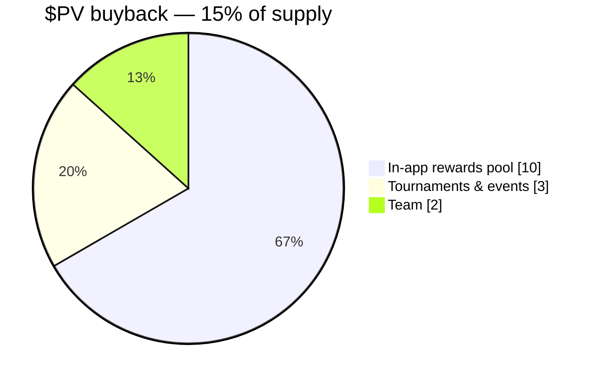

<div align="center">

# 🐾 Petaverse

### Your onchain pet world on Solana

Raise a pet, keep it happy, master the minigames, and earn.
**Petaverse** is a skill‑to‑earn pet universe — part Tamagotchi, part monster‑collector, all onchain.


[Play the demo](#-getting-started) · [How it works](#-how-the-universe-works) · [How to earn](#-how-to-earn) · [Roadmap](#-roadmap)

</div>

---

## 🌍 What is Petaverse?

Petaverse is a browser game where you adopt a little creature and raise it into a legend.

You **feed it, play with it, and keep its stats up** — neglect it and it gets weak. Along the way you
**open chests**, **collect rare pets and gear**, **level up**, **breed new companions**, and prove your
skill in **two minigames**. Everything runs on the **Solana** economy: the in‑game currency is
**PV** (its token is **$PV**), and the marketplace runs on **SOL**.

> 💡 **The idea:** most pet games are *idle* play‑to‑earn. Petaverse is **skill‑to‑earn** — the better
> you play, the more you earn.

---

## ✨ How the universe works

| System | What it does |
|---|---|
| 🐶 **Adopt & name** | Start with a common pet (Dog, Cat, Hamster) and name it. Unlock 11 more — up to **mythic** Dragons & Dinos. |
| 🍖 **Care & stats** | Keep **Fullness**, **Happiness** and **Health** up in real time. Rare+ pets can faint if neglected (base pets never die). |
| 🎁 **Chests** | Spin **food / accessory / pet** chests with a roulette reel. Rarities run **common → rare → epic → legendary → mythic**. |
| 🎀 **Accessories** | 4 gear slots (cap / leash / toy / boots). Boost XP, slow decay, add power & HP for the arena. |
| ⭐ **Levels & perks** | Feed to earn XP and level up. Each species has a unique perk (e.g. Dragon: ×2 PV income). |
| 🧬 **Breeding** | Two pets at **level 5+** breed a brand‑new rare→mythic companion. |
| 🧪 **Potions** | 5 temporary boosts — more PV/min, more arena power, slower decay, more XP. |
| 📋 **Quests** | Ongoing goals (win battles, level up, collect pets) that pay out in **SOL**. |
| 🎰 **PV Roulette** | Gamble your PV on red / black / 0 for a quick multiplier. |
| 🛍️ **Marketplace** | List your pets for **SOL** — fixed‑price sales or **auctions** with a starting bid. |
| 💱 **Exchange** | Swap **PV ↔ SOL** anytime (buying PV is cheaper than selling it back). |

### 🎮 The two minigames

- **🎵 Rhythm** — an osu!mania‑style 4‑lane rhythm game. Nail the notes, build combos, top the leaderboard.
- **⚔️ Battle Arena** — turn‑based PvP. Build your loadout (Power / HP / Crit), place a **bet**, find an
  opponent, win **loot + PV + XP**, and climb the **arena rankings**.

---

## 💰 How to earn

Two currencies power the economy:

- **PV** — the in‑game currency (token **$PV**). You *earn* it by playing.
- **SOL** — Solana's native coin. Used for the **marketplace, auctions and quest rewards**, and you can
  **cash out** PV into SOL.

### The earn loop



### Ways to make PV & SOL

1. **🎵 Be good at the minigames (skill‑to‑earn).** Top rhythm scores rank on the leaderboard and pay
   PV every hour by rank.
2. **⚔️ Win arena battles.** Each win = PV + XP + one loot item. Add a **bet** to double your stake.
3. **📋 Complete quests.** Milestones (5 arena wins, reach level 8, collect 4 pets…) pay out in **SOL**.
4. **😴 Passive PV income.** Your pet earns PV over time — boosted by legendary/mythic gear, species
   perks and potions.
5. **🛍️ Trade on the marketplace.** Sell or auction your pets (with their level & buffs) for **SOL**.
6. **💱 Exchange & hold.** Swap PV to SOL, or hold **$PV** as it grows with the universe.

> ⚠️ **Honest note:** the real‑money layer (wallet, on‑chain trades, global leaderboard) is on the
> [roadmap](#-roadmap). Today Petaverse is a **playable demo** — progress is saved locally in your
> browser, and the economy shows how the full onchain version will work.

---

## 🪙 Tokenomics ($PV)

Petaverse runs a **buyback program**: a share of protocol revenue is used to buy **$PV** back from the
open market. We plan to buy back **15% of the total supply** and put it straight back to work for the
ecosystem:



| Allocation | Share | Purpose |
|---|---|---|
| 🎁 **In‑app rewards pool** | **10%** | Funds every player payout — quest rewards, hourly leaderboard prizes and arena winnings. This is the engine that keeps skill‑to‑earn paying out. |
| 🏆 **Tournaments & events** | **3%** | Seasonal competitions, community challenges and special‑event prize pools for the best players. |
| 👥 **Team** | **2%** | Long‑term development, aligned with the project through vesting. |

**Why it matters:** recycling bought‑back supply into the **rewards pool** ties the token directly to how
much the game is played — more players → more buybacks → a bigger prize pool for everyone.

> 📝 Tokenomics are a **plan** and may be refined before the token launches.

---

## 🚀 Getting started

```bash
# 1. Install dependencies
npm install

# 2. Start the dev server
npm run dev

# 3. Open the game
# http://localhost:5173
```

Build a production version with `npm run build`.

---

## 🗺️ Roadmap

- [x] Core game — pets, care, chests, gear, levels, breeding, potions
- [x] Two minigames — Rhythm + Battle Arena (with bets & rankings)
- [x] PV economy, quests, roulette, marketplace & auction UI, PV↔SOL exchange
- [ ] 👛 **Phantom wallet** connect — your address becomes your player ID
- [ ] 🗄️ **Backend** — real global leaderboard, online PvP, anti‑cheat, live marketplace
- [ ] 🪙 **$PV token** launch on pump.fun
- [ ] 🎨 More original pet art & evolution stages

---

## 🛠️ Tech stack

**React 19** · **TypeScript** · **Vite 8** · plain CSS · `localStorage` (until the backend lands).
Original art only — no copyrighted characters.

---

## 📎 Links

- 🐦 X / Twitter — *coming soon*
- 💊 pump.fun ($PV) — *coming soon*
- 🌐 Website — *coming soon*

---

<div align="center">

*Petaverse is a game. $PV is an in‑game / utility token, not an investment. Nothing here is financial advice.*

**Made with 🧡 on Solana.**

</div>
